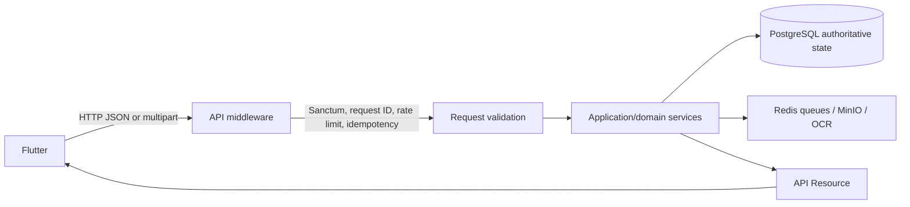
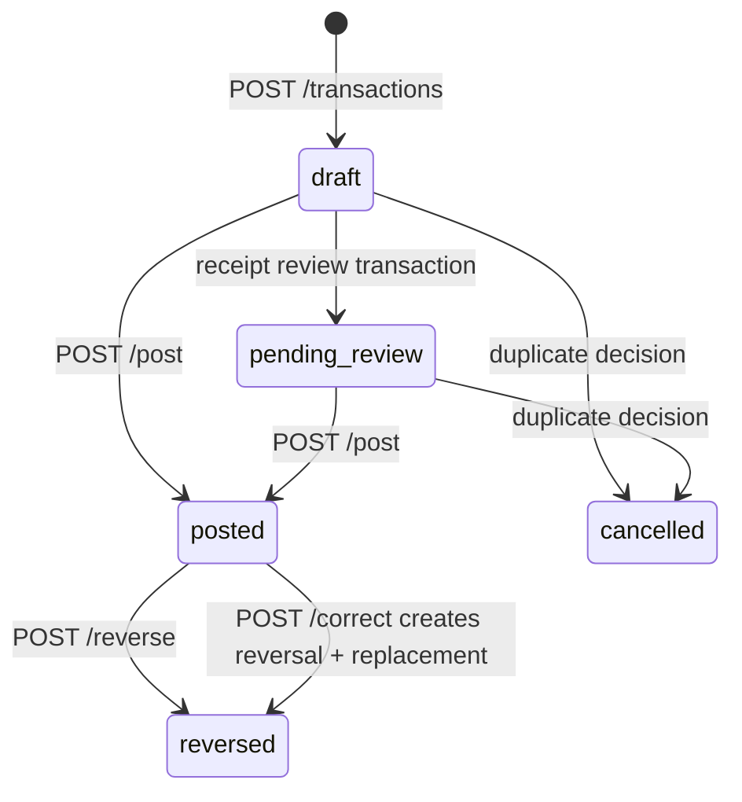
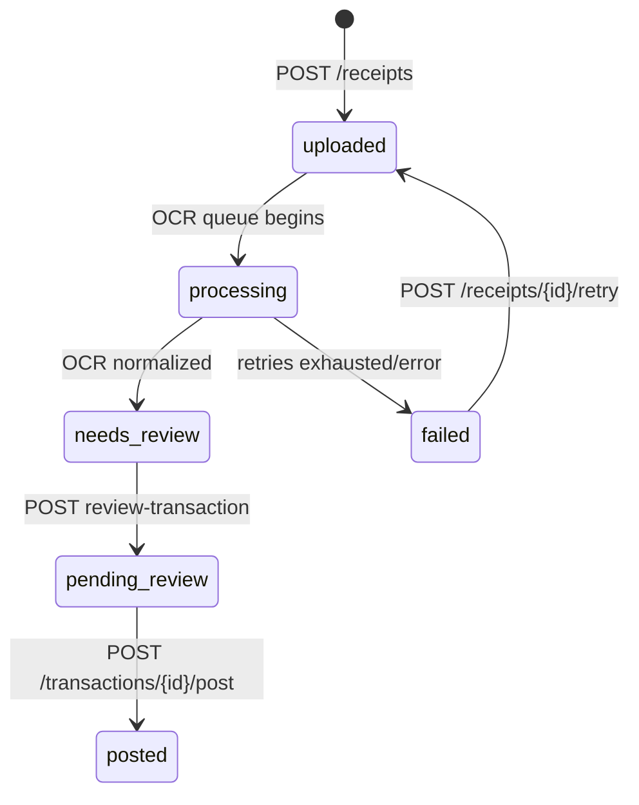

# Flutter Backend Integration Guide

## 1. Guide Status

| Item | Value |
| --- | --- |
| Reviewed | 2026-08-17 |
| Backend source branch | `dev` |
| Backend source commit | `b8bfeee024dd6e242f1a7996c0072c32bf3a1124` |
| Documentation branch | `feat/020-flutter-integration-guide` |
| Framework | Laravel `13.25.0` (`laravel/framework` constraint `^13.17`) |
| PHP runtime reviewed | PHP 8.5.0 |
| API namespace | `/api/v1` |
| OpenAPI document | OpenAPI 3.1.0, API version `1.0.0` |

This guide describes the **implemented Laravel backend at the source commit above**. It is not a PRD or a forward-looking specification. Planned work that is absent from that commit is identified in [Unsupported / Not Yet Implemented](#45-unsupported--not-yet-implemented).

> **Authority rule:** Laravel is the authoritative financial and business system. Flutter is an untrusted client, presentation layer, and offline cache. Flutter MUST NOT independently reproduce ledger posting, balances, budget calculations, rollover, overspending carry, borrowing, reallocations, FX conversion or historical rate locking, canonical normalization, duplicate determination, forecasts, Safe-to-Spend, income concentration, Item Price Movement, report totals, or authorization. Where Laravel returns a calculated value, persist/display that value rather than recalculating it.

## 2. Backend Architecture Overview

Laravel 13 runs a PostgreSQL-backed, Redis-queued API. Private MinIO-compatible object storage holds receipt originals, OCR derivatives, and generated report/export artifacts. PaddleOCR is called asynchronously for receipt recognition. Authentication uses Laravel Sanctum bearer personal-access tokens.

The client-relevant bounded areas are Identity, Accounts, Categories, Currency/FX, Transactions and immutable Journal, Budgeting, Receipts/OCR, Catalog Normalization, Duplicate Detection, Sync, Insights, Notifications, and Reporting/Exports. Controllers authorize and validate; application/domain services create authoritative state; API Resources serialize the client contract.



All user-scoped resources are ownership-checked. A guessed UUID normally returns `RESOURCE_NOT_FOUND` rather than exposing whether another user owns it.

## 3. Base API Conventions

### Transport and headers

| Concern | Actual contract |
| --- | --- |
| Base path | `/api/v1` |
| JSON requests | `Content-Type: application/json` and `Accept: application/json` |
| Multipart receipt upload | `multipart/form-data`; still send `Accept: application/json` |
| Authentication | `Authorization: Bearer <Sanctum token>` for all non-auth routes |
| Request correlation | Optional `X-Request-Id: <UUID>`. Invalid/missing values are replaced by Laravel; the response always has `X-Request-Id`. |
| Mutation idempotency | Every implemented mutation route requires `Idempotency-Key: <non-empty string, max 255>`; use a UUID generated once per logical attempt. |
| Resource concurrency | `If-Match: <integer version>` where stated below. It is an unquoted decimal integer, not an HTTP ETag. |
| Rate limits | Auth: 5/minute by email+IP; ordinary authenticated API: 120/minute/user; receipt upload/retry: 10/minute/user; report creation: configured, default 10/minute/user. |
| Dates/timestamps | Input date-times use ISO-8601-compatible Laravel `date` input; returned instants are ISO 8601 UTC strings such as `2026-08-01T09:30:00.000000Z`. Local date-only values are `YYYY-MM-DD`. |
| Timezones | IANA names such as `Africa/Addis_Ababa`. Budget month boundaries use the user’s `budget_timezone`, not server time. |
| Money | Amounts are integer minor units. Decimal FX/analytic values are exact decimal **strings**. See [Money Representation](#8-money-representation). |
| Enum values | Lowercase strings unless explicitly shown otherwise. Send only documented values. |

`EnsureJsonRequest` rejects API requests that neither accept JSON nor are JSON with `406 NOT_ACCEPTABLE`. Report download is the explicit non-JSON exception: it streams the private artifact bytes.

### Collection behavior

Only some collections use cursor pagination. When a collection response includes `meta.next_cursor`, retain it verbatim and pass it as `cursor` on the next call where documented. Do not decode it.

`GET /transactions` has stable descending order by `occurred_at`, then `id`. `GET /receipts`, `GET /reports`, and `GET /exchange-rates` provide an opaque cursor. Categories, accounts, merchants, items, notifications, normalization candidates, devices, currencies, and budget lists are not paginated by the current API.

## 4. Standard Response Envelope

Successful JSON responses always use this envelope:

```json
{
  "data": {
    "id": "5cb59af6-03fb-4be5-9414-05aa750039f6"
  },
  "meta": {},
  "links": {}
}
```

For collections, `data` contains a named list, for example `data.accounts`, and an opaque cursor is in `meta`:

```json
{
  "data": { "transactions": [] },
  "meta": { "next_cursor": "opaque-cursor-or-null" },
  "links": {}
}
```

Downloads (`GET /receipts/{id}/download` and `GET /reports/{id}/download`) are authenticated byte streams, not this envelope. Do not attempt to JSON-decode a successful download.

## 5. Standard Error Contract

Laravel’s API errors use:

```json
{
  "error": {
    "code": "VALIDATION_FAILED",
    "message": "The given data was invalid.",
    "fields": {
      "email": ["The email field must be a valid email address."]
    },
    "request_id": "a6c66cef-2dd1-4aa7-b0d3-e05da2638604"
  }
}
```

`fields` is an empty object for non-validation errors. Keep the `request_id` with the local error record/support report.

| Error code | HTTP | Meaning | Flutter action |
| --- | ---: | --- | --- |
| `NOT_ACCEPTABLE` | 406 | JSON acceptance requirement was not met. | Fix headers; do not retry unchanged. |
| `UNAUTHENTICATED` | 401 | No valid bearer token, expired token, or session revoked. | Mark server session unavailable; preserve local drafts/outbox; require login before server sync. |
| `DEVICE_SESSION_NOT_FOUND` | 401 | Refresh/rotate was requested for no active device session. | Treat as revoked; require login. |
| `RESOURCE_NOT_FOUND` | 404 | Missing resource or resource not owned by caller. | Remove/refresh stale local reference; never infer another user’s existence. |
| `CONCURRENCY_CONFLICT` | 409 | Required `If-Match` is missing/stale, or a synchronized update used a stale version. | Persist a conflict; fetch authoritative entity; require a deliberate resolution. |
| `STALE_VERSION` | 409 | Profile, onboarding, preferences, or notification version missing/stale. | Fetch current data and require a deliberate retry. |
| `SYNC_CURSOR_EXPIRED` | 409 | Cursor invalid, expired, or used with a different full/incremental mode. | Perform a full authoritative pull (`full=true`); never accept an incomplete incremental result. |
| `IDEMPOTENCY_KEY_REUSED` | 409 | Same key was sent for same method/path with different request content. | Do not retry; create a new logical operation only after user/app resolution. |
| `IDEMPOTENCY_IN_PROGRESS` | 409 | Another matching mutation still holds the idempotency lock. | Retry later with the **same** key. |
| `REPORT_NOT_READY` | 409 | Report not complete or expired. | Poll report job; if expired, request a new report. |
| `REPORT_ARTIFACT_UNAVAILABLE` | 409 | Completed report’s private object cannot be read. | Show unavailable; request another report if appropriate. |
| `VALIDATION_FAILED` | normally 422 | Request shape/field validation failed. | Show field errors; do not automatically retry unchanged. |
| `INVALID_CREDENTIALS` | 422 | Login credentials are wrong. | Show authentication failure; do not treat as offline failure. |
| `PASSWORD_RESET_FAILED` | 422 | Password reset token/request failed. | Show backend message; restart recovery if needed. |
| `BASE_CURRENCY_LOCKED` | 422 | Base currency cannot change after posting history. | Disable normal setting change; explain a future rebasing feature is required. |
| `ACCOUNT_CURRENCY_LOCKED` | 422 | Account currency cannot change after journal history. | Create a new account instead. |
| `INVALID_RATE_LOCK` | 422 | No fresh rate or an invalid manual FX override. | Ask for a valid manual rate, reference rate, and reason when allowed. |
| `CURRENCY_MISMATCH` | 422 | Currency/account/budget relationship is invalid. | Correct fields; do not convert locally and resubmit blindly. |
| `UNSUPPORTED_CURRENCY` / `INACTIVE_CURRENCY` | 422 | Currency is absent/inactive in registry. | Refresh `/currencies`; block that selection. |
| `INVALID_MONEY` | 422 | Invalid amount, split reconciliation, or budget amount. | Correct values; use integer minor units. |
| `INVALID_STATE_TRANSITION` | 422 | Action is not valid for current lifecycle state. | Fetch resource and update UI state. |
| `SYNC_DEPENDENCY_UNRESOLVED` | 422 | A sync mutation references a server entity not yet accepted. | Sync dependencies first, then retry with the same operation only if no result was recorded. |
| `SYNC_DEVICE_INVALID` | 422 | Sync device is missing/revoked. | Reauthenticate/register active device through login; stop push. |
| `INVALID_OPERATION_ID` | 422 | A sync operation UUID was reused with different content. | Treat as permanent local outbox corruption; create a new operation after reconciliation. |
| `UNAUTHORIZED_ACTION` | 422 | A business rule forbids the action (for example, system category change). | Show rule; do not retry automatically. |

There is no API-specific stable `400` contract in this commit. `403` is used by API-document access policy when disabled, not as the normal user-resource contract. A `429` is Laravel rate limiting; honor `Retry-After` if supplied and apply backoff. No custom stable 5xx error schema is implemented: show a retryable-unavailable state for reads and only retry mutations under their idempotency contract.

## 6. Authentication & Session Lifecycle

### Endpoints and behavior

| Method/path | Request | Result |
| --- | --- | --- |
| `POST /auth/register` | `name`, `email`, `password`, `password_confirmation` | `201` Profile resource only. It **does not issue a token** and ignores device fields. Login next. |
| `POST /auth/login` | `email`, `password`, `client_device_id` UUID, `platform: "android"`, optional `app_version` | `200` bearer token, `token_type: "Bearer"`, profile, device. |
| `POST /auth/logout` | no body | Revokes the current token/device; `{ "revoked": true }`. |
| `POST /auth/refresh-or-revoke` | `{ "action": "refresh" }` or `{ "action": "revoke" }` | `refresh` rotates to a new bearer token for the current device; `revoke` revokes all tokens/devices. |
| `POST /auth/forgot-password` | `email` | Always `202 {"accepted":true}`; do not infer whether email exists. |
| `POST /auth/reset-password` | `token`, `email`, `password`, `password_confirmation` | Resets password and revokes all device sessions. |

Login is **single-device**. In one database transaction Laravel deletes all existing user tokens and marks all active devices revoked, then creates the newly logged-in Android device/token. A login on another device therefore causes old tokens to receive `401 UNAUTHENTICATED` on their next protected request.

The `refresh-or-revoke` `refresh` action is bearer-token rotation, not OAuth refresh-token support. There is no refresh-token field, endpoint grant, or token-pair lifecycle. Flutter MUST NOT implement an invented refresh-token flow. Store the bearer token only in platform secure storage; replace it atomically after a successful rotate response.

On revocation/auth loss, Flutter may retain local drafts, local media staging, and unsent outbox records. It must stop server mutations and not display local drafts as posted/balance-affecting truth. After login, run sync/reconciliation before offering stale actions.

## 7. User Bootstrap / Initial Setup

`GET /me` returns profile: `id` (user UUID), `name`, `email`, `version`, `created_at`, `updated_at`.

`GET /onboarding` returns `base_currency_code`, `timezone`, `budget_timezone`, `notification_preferences`, `onboarding_completed`, and `version`. `PUT /onboarding` requires an `If-Match` version and all of:

```json
{
  "base_currency_code": "ETB",
  "timezone": "Africa/Addis_Ababa",
  "budget_timezone": "Africa/Addis_Ababa",
  "seed_starter_data": true,
  "notification_preferences": {}
}
```

`seed_starter_data` defaults to `true`; starter accounts/categories are server-created. Read `/currencies` for active codes and exponents before presenting choices.

Before a user has posted a transaction, base currency may be changed. Once any transaction is posted, normal base-currency change is rejected with `BASE_CURRENCY_LOCKED`. Existing initialized budget periods retain their snapshotted timezone/boundaries; a later budget-timezone change applies only to not-yet-initialized periods.

## 8. Money Representation

All posted/request monetary amounts use integer **minor units**, never decimal JSON numbers:

```json
{
  "original_amount_minor_units": 125050,
  "original_currency_code": "USD",
  "base_amount_minor_units": 17199350,
  "base_currency_code": "ETB"
}
```

Use the currency registry’s `minor_unit_exponent` to format only. ETB is seeded with exponent 2 and USD with exponent 2. Flutter must use integer/decimal-safe libraries; NEVER use binary floating point for money or rate calculations.

| Value | Wire form | Meaning |
| --- | --- | --- |
| `*_minor_units` | JSON integer | Authoritative amount in that field’s adjacent currency. |
| `currency_code` | three uppercase letters | ISO-style supported code. |
| FX `rate`, `reference_rate`, `used_rate` | decimal string | Exact rate, up to 18 fractional digits in request validation. |
| Insight ratios/unit prices | decimal string | Exact computed decimal, not a JSON float. |
| `quantity`, `pack_size_value` | string/JSON decimal as returned | Do not parse through `double`; use decimal-safe handling. |

Flutter may format currency and make non-authoritative UI previews. Laravel alone determines posted base amount, journal balance, budget actuals/effective limits, rate choice, and reported totals.

## 9. Currency & FX

The user base currency is reporting/functional currency. A financial account has one native `currency_code`; a transaction has `original_amount_minor_units`/`original_currency_code`. A posted foreign-currency transaction returns its locked `base_amount_minor_units`, `base_currency_code`, `reference_rate`, `used_rate`, `rate_date`, `rate_source`, and `rounding_mode`.

On posting, Laravel obtains the supported historical rate and locks it. If no fresh rate exists, posting fails with `INVALID_RATE_LOCK` unless the request provides a manual `used_rate` together with `reference_rate` and non-empty `rate_override_reason`; Laravel then stores `rate_source: "manual_override"` and the approved rounding mode. Flutter must never recompute a posted transaction’s base amount from today’s rate.

Cross-currency transfer sends source amount/currency plus destination amount/currency/account. Laravel stores native values and balances journal lines in base currency; any base difference is posted to internal FX rounding/gain-loss ledger accounts. There is no client endpoint to refresh rates, override provider configuration, or edit historical rate records. `GET /exchange-rates` is read-only and paginated.

Account native currency may be edited only before that account has posted journal history. After posting, API rejects it with `ACCOUNT_CURRENCY_LOCKED`; create another account instead.

## 10. Accounts

Account resource fields: `id`, `name`, `type`, `accounting_type` (`asset` or `liability`), `currency_code`, `opening_balance_configured`, `archived_at`, `version`, `created_at`, `updated_at`.

Types accepted by account requests: `cash`, `bank`, `mobile_wallet`, `savings`, `credit_card`, `loan`, `investment`, `other`. Credit cards and loans map to liabilities; all others map to assets.

`GET /accounts` includes all owned accounts ordered by name; it does not paginate. `GET /transactions/balances` is the authoritative native balance list `{account_id,currency_code,balance_minor_units}`. Do not derive an account balance from local transactions.

Creating requires `name` max 120, `type`, uppercase active `currency_code`, optional `opening_balance_configured`. Updating, archive, and restore require `If-Match`; archive/restore changes `archived_at`. Archived accounts remain historical but posting rejects an archived primary/destination account. No hard-delete account API exists.

## 11. Categories

Category resource fields: `id`, `parent_id`, `name`, `kind` (`expense`/`income`), `is_active`, `is_system`, `budget_enabled`, `forecast_behavior`, `base_limit_minor_units`, `budget_currency_code`, `rollover_enabled`, `overspend_carry_enabled`, `borrowing_enabled`, `archived_at`, `version`, timestamps.

Parents must be owned, active, same-kind categories; cycles/self-parenting are rejected. System categories cannot be changed through category endpoints. A budget currency, if sent, must equal the user base currency. User-created categories default to `forecast_behavior: "variable"`.

Create requires `name` max 120 and `kind`; optional configuration fields are shown in [Endpoint Reference](#39-endpoint-reference). Update/archive/restore require `If-Match`. Archiving makes the category inactive; historic references persist.

## 12. Transactions & Ledger

### Authoritative posting model

`POST /transactions` creates a **server draft**, never an immediately posted transaction. Post it with `POST /transactions/{id}/post` and `If-Match` equal to the current transaction version. Laravel then locks FX, validates type-specific rules/splits/duplicates, creates immutable double-entry journal lines, locks currency history, recalculates budgets, and returns the posted resource.

Every journal is balanced in the user base/functional currency. Native account amounts remain on journal lines for account balances. Flutter never creates journal lines.

### Implemented transaction types and inclusion matrix

| Type | Flutter supplies / required relationship | Accounting and balance effect | Expense reporting & budget | Income reporting |
| --- | --- | --- | --- | --- |
| `expense` | active primary asset/liability? account matching original currency; expense category or reconciled splits | Debit expense-category ledger; credit primary account. | Included; split/category allocation is authoritative. | Excluded. |
| `fee` | same shape as expense | Same as expense. | Included. | Excluded. |
| `income` | primary account + **income** category | Debit account; credit income category/revenue. | Excluded. | Included. |
| `transfer` | primary source, different active destination; destination currency must match destination account; optional destination amount | Debit destination account; credit source; FX difference internalized. | Excluded. | Excluded. |
| `credit_card_purchase` | primary account must be `credit_card`; expense category/splits | Debit expense; credit credit-card liability. | Included exactly once. | Excluded. |
| `credit_card_repayment` | primary account must be credit card; counterparty must be asset and matching native currency | Debit card liability; credit asset payment account. | Excluded—never a second expense. | Excluded. |
| `refund` | linked `related_transaction_id` must be posted `expense`, `fee`, or `credit_card_purchase` | Debit receiving account; credit original expense category. | Negative original-category spend, assigned to original transaction’s budget period. | Excluded. |
| `opening_balance` | primary account | Account versus opening-balance equity. | Excluded. | Excluded. |
| `adjustment` | `adjustment_subtype: "balance_correction"`, `adjustment_direction: "debit"|"credit"`, non-empty `reason` | Account versus balance-correction equity. | Excluded. | Excluded. |

The server request validator permits only `balance_correction` for manual adjustments. `financial_system_adjustment` exists internally but is not client-creatable. Budget adjustments are a separate budget subsystem, never financial transactions.

## 13. Transaction Lifecycle

Server financial state and Flutter local sync state are different things. Do not merge them into one enum.



Implemented server state strings are `draft`, `pending_review`, `posted`, `reversed`, `sync_conflict`, `cancelled`. The last two are enum/model concepts; normal sync conflict is represented primarily by `SyncOperation.status: "conflict"`, and no endpoint currently sets a financial transaction to `sync_conflict`.

Only `draft` and `pending_review` can be updated/deleted/posted. Posted values are financial truth. Flutter local states such as `local_draft`, `queued`, `failed`, and `conflict` belong only in Flutter’s local database/outbox.

## 14. Posted Transaction Immutability

There is no destructive edit/delete for posted transactions. `PATCH` and `DELETE` are rejected outside draft/pending review.

* `POST /transactions/{id}/reverse` requires a posted transaction, `If-Match`, and `{ "reason": "..." }`. It creates a linked opposite journal transaction (`state: "reversed"`) and marks original `reversed`; a posted transaction can be reversed exactly once.
* `POST /transactions/{id}/correct` requires `If-Match`, mandatory `reason`, and a full valid replacement transaction payload. Laravel reverses the original, creates replacement with `correction_of_id`, then posts it atomically.
* Refund is not a destructive correction. Create a separate draft `type: "refund"` with `related_transaction_id` pointing to the original posted expense/fee/card purchase, then post it.

All financial mutations should be created with an idempotency key. Preserve `journal_entry_id`, `reversal_of_id`, `correction_of_id`, `related_transaction_id`, state, and version returned by Laravel.

## 15. Splits and Line Items

Transactions accept `splits` on create/update/review-transaction. Each split has required `category_id`, `amount_minor_units`, `currency_code`; optional `canonical_item_id`, `raw_item_text`, `classification` (`category`, `tax`, `fee`, `discount`, `rounding`), and `description`. On posting, splits must sum exactly to the transaction original amount and each split currency must equal original currency.

```json
"splits": [
  {
    "category_id": "3d3f2f0c-1fdc-4dd6-a22a-4a3a1ef4f073",
    "amount_minor_units": 125000,
    "currency_code": "ETB",
    "classification": "category",
    "raw_item_text": "Groceries"
  }
]
```

`line_items` and canonical-unit infrastructure exist for OCR/insight data, but the current public API does **not** expose an endpoint or request field to create/update receipt line items, quantities, unit prices, line discounts, taxes, tips, delivery fees, or receipt-level discounts. `splits` are not receipt `line_items`. Flutter must not assume item price intelligence can be populated through the implemented API.

## 16. Idempotency

Every `POST`, `PUT`, `PATCH`, and `DELETE` API mutation in `routes/api.php` is behind `idempotency`; it is required even for login, logout, password flows, read marking, and sync push.

* Header: `Idempotency-Key`.
* Scope: authenticated user for protected routes; public scope is derived from IP and email for public auth routes.
* Unique comparison: scope + key + HTTP method + path + canonical request hash.
* Same key/same request: Laravel returns the stored original status/body and `Idempotency-Replayed: true`.
* Same key/different request: `409 IDEMPOTENCY_KEY_REUSED`.
* Request currently executing: `409 IDEMPOTENCY_IN_PROGRESS`.

A timeout/network disconnect does not prove a mutation failed. Store the exact key and request payload in Flutter’s durable outbox. Retry a financial mutation only with the same key and same payload. Generate a new key only for a genuinely new logical operation.

## 17. Optimistic Concurrency

Mutable API resources carry integer `version`. Store that server version with the local server entity.

| Resources/actions requiring `If-Match` | Behavior |
| --- | --- |
| accounts: patch/archive/restore | Required; stale/missing => `CONCURRENCY_CONFLICT` 409. |
| categories: patch/archive/restore | Required; stale/missing => `CONCURRENCY_CONFLICT` 409. |
| transactions: patch/delete/post/reverse/correct | Required; stale/missing => `CONCURRENCY_CONFLICT` 409. |
| onboarding, profile, notification preferences, notification read | Required; stale/missing => `STALE_VERSION` 409. |
| sync update/archive/restore/delete/post | `expected_version` body property required by service; stale becomes completed operation status `conflict`. |

Never implement blanket Last-Write-Wins. On a conflict, retain the local unsynced intent, fetch/pull authoritative data, show a deliberate merge/retry path, and use the new version only after the user/app has resolved the semantic conflict.

## 18. Sync Protocol

The implemented sync API is authenticated and supports push operations plus pull changes.

### Push

`POST /sync/push` requires normal idempotency plus:

```json
{
  "operation_id": "b97076ff-e02b-408e-94f9-e1ff81552080",
  "device_id": "a9c5f037-9702-4dbb-a56a-ed745791a2bc",
  "entity": "transaction",
  "action": "create",
  "local_id": "4dc9c310-27dd-4824-8d46-d47cdb748153",
  "server_id": null,
  "expected_version": null,
  "payload": { "...": "same validated fields as normal endpoint" },
  "client_occurred_at": "2026-08-17T10:00:00Z"
}
```

Supported entities: `account`, `category`, `merchant`, `item`, `transaction`. Supported actions are request-validated as `create`, `update`, `delete`, `post`, `archive`, `restore`, but actual service support is narrower:

| Entity | Supported sync actions |
| --- | --- |
| account | create, update, archive, restore |
| category | create, update, archive, restore |
| merchant | create only |
| item | create only |
| transaction | create, update, post, delete |

The device UUID must be an active device created by login. The operation is processed synchronously inside the request but endpoint response remains `202`. Its resource has `status: succeeded|failed|conflict`, server resource in `resource`, and a persisted error `{code,fields}` on failure/conflict. Reuse the same `operation_id` only with byte-equivalent logical attributes; an existing matching operation returns its prior result.

### Pull

`GET /sync/pull?cursor=<opaque>&full=true|false&limit=1..250` returns:

```json
{
  "data": {
    "changes": [
      {
        "resource_type": "account",
        "resource_id": "...",
        "action": "upsert",
        "version": 2,
        "changed_at": "2026-08-17T08:00:00.000000Z",
        "resource": { "id": "..." }
      }
    ],
    "next_cursor": null,
    "authoritative_cursor": "opaque",
    "full_resync": false,
    "ordering": {
      "fields": ["changed_at", "resource_type", "resource_id"],
      "direction": "ascending",
      "snapshot_at": "2026-08-17T08:00:00.000000Z",
      "tombstone_retention_days": 30
    }
  },
  "meta": {},
  "links": {}
}
```

Pulled resource types are `account`, `category`, `budget_period`, `merchant`, `item`, `receipt`, `transaction`; deletions appear as `action: "delete", resource: null`. Ordering is stable ascending by `changed_at`, `resource_type`, `resource_id` over a snapshot. Follow `next_cursor` until null, then save `authoritative_cursor` as the incremental cursor.

Incremental cursors older than configured `SYNC_CURSOR_RETENTION_DAYS` (default 30) or invalid/mode-mismatched cursors return `409 SYNC_CURSOR_EXPIRED`. Tombstones are retained for default 30 days. On expiration, clear/reconcile server-cache entities and pull `full=true`; never silently continue incrementally. Full resync starts at epoch and includes all current sync-mapped resources plus currently retained tombstones, so it may not express a deletion whose tombstone retention already elapsed.

## 19. Offline Client Expectations

Flutter owns durable local drafts, queued outbox operations, attachment staging, local IDs, and presentation sync status. Laravel owns acceptance, financial lifecycle, IDs, versions, calculations, and conflict decisions.

Recommended implemented flow:

```mermaid
sequenceDiagram
  participant F as Flutter local DB/outbox
  participant L as Laravel
  F->>F: persist local draft + operationId + idempotency key
  F->>L: POST /sync/push or normal mutation
  L->>L: validate/authorize/apply authoritative operation
  L-->>F: resource or SyncOperation result
  F->>F: map localId to serverId; persist server version
  F->>L: GET /sync/pull with authoritative cursor
  L-->>F: ordered upserts/tombstones
```

Safe offline creation is limited to data Flutter labels as local until server confirmation. Financial posting, budget borrowing/reallocation, receipt upload/OCR, reports, and insight values require Laravel. Sync dependent server entities first: account/category/merchant/item before a transaction that references them. Current sync does not resolve temporary UUID references atomically.

## 20. Receipts & Files

`POST /receipts` uses multipart field **`receipt`**, `Accept: application/json`, bearer token, and `Idempotency-Key`.

| Rule | Implemented behavior |
| --- | --- |
| MIME/signature | JPEG, PNG, WebP only; MIME, image signature, and decoder metadata must agree. |
| Size | Configurable `RECEIPT_MAX_UPLOAD_BYTES`, default 15 MiB. |
| Pixels | Configurable `RECEIPT_MAX_PIXELS`, default 24,000,000. |
| Key/filename | Server generates private object key. Client filename is reduced to basename and retained only for download name. |
| Duplicate source | Same user checksum returns existing non-deleted receipt instead of a second stored source. |
| Response | Receipt resource, initially normally `status: "uploaded"`; returns `201`. |
| Download | `GET /receipts/{id}/download` authenticated stream of original private image. |
| Delete | No public receipt deletion endpoint exists. |

Keep a locally staged image until a receipt response is confirmed. If connectivity fails, retain the local file and the same idempotency request state; do not assume upload succeeded. Private storage keys are never client-supplied or returned.

## 21. OCR Workflow



Laravel retains original image unchanged; it produces a separate private OCR JPEG derivative using preprocessing version `v1` (orientation normalized, metadata stripped, JPEG normalized, max width 2400). PaddleOCR PP-OCRv6 work is queued (`3` tries; backoff `10,60,300` seconds; 75-second job timeout). Flutter polls `GET /receipts/{id}` or receipt list; there is no webhook/SSE/push status API for OCR completion.

The latest extraction exposed in `ReceiptResource.extraction` includes `id`, `status`, `parser_version`, `locale`, `normalized_data`, `confidence`, `failure_reason`. Raw OCR provider payload, storage keys, and preprocessing derivative metadata are intentionally not exposed.

Parser V1 supports English/Amharic scripts, ETB/USD names, deterministic labeled totals (`1,250.50`, `1.250,50`, `1 250,50`), and unambiguous ISO/month-name dates. Numeric slash/dash dates such as `11/08/2026` are retained as ambiguity (`ambiguous_numeric_date`) rather than guessed. Currency symbols such as `$`, `€`, `£`, and `Br` are ambiguity markers, not authoritative currency selection. The normalized payload’s `receipt_type` is currently always `unknown`; there is no implemented client endpoint to choose purchase vs transfer receipt type.

OCR never posts a journal. Once receipt is `needs_review`, Flutter submits the full ordinary transaction payload to `POST /receipts/{receipt}/review-transaction`; Laravel creates a `pending_review` transaction with source `receipt_ocr`. Flutter must review/edit/post that transaction through the normal transaction API.

## 22. Merchant Normalization

Transactions can carry `raw_merchant_text` and optional canonical `merchant_id`. Merchant resource fields: `id`, `display_name`, `normalized_search_key`, `location`, `normalization_version`, `is_active`, `merged_into_id`, `version`, timestamps.

`GET /merchants` lists active unmerged owned merchants; `POST /merchants` creates one from `display_name` and optional `location`. Laravel rejects duplicate normalized names. A merchant merge posts `{ "target_id": "UUID" }` to `/merchants/{merchant}/merge`; source becomes inactive/merged, not deleted.

OCR normalization creates merchant candidates asynchronously after OCR. Fetch `GET /normalization-candidates`; accept/reject with `POST /normalization-candidates/{id}/resolve`. The current candidate acceptance service changes `line_item` associations for item candidates; it does not assign a canonical merchant to a transaction. Flutter should display raw text and suggestions but not claim a merchant has been applied unless returned data proves it.

## 23. Item Normalization

Item resource fields: `id`, `canonical_name`, `normalized_search_key`, `unit_code`, `pack_size_value`, `pack_size_unit`, `normalization_version`, `is_active`, `merged_into_id`, `version`, timestamps.

Create with `canonical_name` plus optional unit/pack fields. Item merge requires a compatible normalized dimension. Normalization candidates identify `entity_type` (`merchant`/`item`), raw value, candidate IDs, score string, version, and `suggested|accepted|rejected|superseded` status.

The Item Price Movement calculator recognizes mass (`g`, `kg`) and volume (`ml`, `l`) compatible normalized units. It does not compare dimensions such as kilograms and litres. Public endpoints do not expose a way to create receipt line items, so Flutter cannot presently populate all fields needed for item-price calculation through API alone.

## 24. Duplicate Detection

Laravel discovers candidates when a transaction draft is created or updated and again before posting. It considers original amount/currency, occurrence proximity, account, merchant/raw merchant, reference number, and receipt checksum. Candidate algorithm version is `duplicate-score-v1`; score and score breakdown are returned.

* `GET /transactions/{id}/duplicates` refreshes/returns candidates.
* `POST /transactions/{id}/duplicate-decision` requires `{ "candidate_id": "UUID", "decision": "view_existing|keep_both|replace_pending_draft|cancel_current_import" }`.
* Unresolved `suggested`/`viewed` candidates block posting. `keep_both` resolves without deletion. `replace_pending_draft` can cancel only an unposted candidate. `cancel_current_import` cancels current draft.

Financial duplicate detection is separate from HTTP idempotency. Flutter must never silently delete a probable duplicate.

## 25. Budget Engine

Budgets are separate from account balances/journals. `GET /budgets?month=YYYY-MM` lazily initializes active expense budget categories in the user budget timezone; the scheduler uses the same initialization service. Do not wait for month scheduler success before rendering a budget read.

Budget resource fields include `base_limit_minor_units`, `borrowing_deduction_minor_units`, `positive_rollover_minor_units`, `negative_carry_minor_units`, reallocation in/out, `effective_limit_minor_units`, `actual_spent_minor_units`, `remaining_minor_units`, month/year, timezone and exact UTC boundaries, status, currency, version.

Actual implemented effective-limit calculation is:

```text
base limit
+ borrowing_in for current period
- borrowing_reserved deduction
+ positive rollover
- negative carry
+ reallocation in
- reallocation out
+ immutable correction adjustments
```

Period initialization snapshots the category base limit/configuration/timezone. It first resets base, then a prior borrowing reservation, then prior positive rollover or negative carry, with reallocations subsequently represented by adjustment records. Late/backdated posting, corrections, reversals, and refunds recalculate affected chain effects by adding immutable `correction` adjustments to later periods; Laravel does not silently rewrite historical adjustment records.

Refund budget impact is attached to the original linked transaction’s budget period, not necessarily the refund occurrence month. Flutter should display returned period actual/remaining values rather than model the correction chain itself.

## 26. Budget Borrowing

`POST /budgets/{category}/borrow-next-month` body:

```json
{ "month": "2026-08" }
```

Laravel accepts no amount. For an active expense category whose period snapshot enables borrowing and has positive base limit, it borrows **exactly one full source-period base-limit snapshot** from only the immediately following period. It atomically creates linked `borrowing_in` source and `borrowing_reserved` target adjustments in one PostgreSQL transaction, under row locks and a partial unique target reservation constraint. The returned source BudgetPeriod reflects the current-period effect.

The target period’s base availability is reduced by that snapshotted full amount before rollover/underflow. Base limit is not changed. A category cannot reserve the same target twice and a reserved future period cannot borrow again. Flutter must not offer partial/chained/skip-month borrowing or calculate a borrow amount from a changed category setting.

## 27. Budget Reallocation

`POST /budgets/{sourceCategory}/reallocate` body:

```json
{
  "month": "2026-08",
  "target_category_id": "82b3d6df-f7fb-4c9a-8a38-d4f43abdfe39",
  "amount_minor_units": 50000
}
```

It requires a positive amount, distinct owned target category, same budget currency, and both periods open. Laravel atomically creates linked `reallocation_out` (negative source) and `reallocation_in` (positive target) adjustments. It moves budget capacity only; it never transfers cash or changes financial-account balances/base limits.

## 28. Safe-to-Spend

`GET /insights/safe-to-spend?month=YYYY-MM` returns live, not persistently snapshotted-on-read, result with formula `{ "name":"safe_to_spend", "version":1 }`.

For every active expense budget it returns category effective limit, actual spending, remaining, and status `available|overspent`. `total_remaining_minor_units` is their sum, so positive categories can offset an overspent category globally while the overspent row remains visible. `value_minor_units = max(0,total_remaining) / remaining calendar days including today`, exact-decimal then half-even rounded to integer minor units. Final day denominator is one.

No active expense budgets yields `value_minor_units: null`, `status: "not_available"`, `reason: "no_active_budgets"`, not zero. Return metadata includes budget-period boundaries/timezone/base currency/calculated time. Flutter must not add rollover, borrowing, or refund logic again: they are already in effective limits/actuals.

## 29. Projected Month-End Spending

`GET /insights/forecast?month=YYYY-MM` returns formula `{ "name":"category_aware_projected_spend", "version":1 }`, current actual, expected remaining, projected total, effective total budget, projected difference, alert eligibility, metadata, and per-category output.

The rejected global formula `actual / elapsed_days × total_days` is not implemented and MUST NOT be reintroduced by Flutter.

| Behavior | Implemented V1 calculation |
| --- | --- |
| `fixed` | Up to three preceding completed budget periods with positive actual spending; median. Projection is `max(current actual, typical)`; no history means actual only/zero expected and `insufficient_history`. |
| `periodic` | Up to previous 120 days of qualifying posted expense allocations; positive same-day events grouped. Requires at least three day occurrences and positive median interval. Predict repeated median-interval dates strictly after today and before period end; insufficient history falls back to variable with `method_used: "variable_fallback"`. |
| `variable` | Last 30 local calendar days ending today (or available history); spend divided by **covered calendar days**, then multiplied by remaining days after today. Exact decimal and half-even final minor-unit rounding. |

Each category returns `forecast_behavior`, `forecast_method`, `method_used`, `data_quality`, `history_window`, `current_actual_minor_units`, `expected_remaining_minor_units`, `projected_amount_minor_units`. Only authoritative posted expense allocations (including refund effects) are used. Forecast overspend notification eligibility starts at elapsed budget day 5; actual overspend eligibility is immediate. This endpoint itself does not emit notifications.

## 30. Income Concentration

`GET /insights/income-concentration` returns formula `{ "name":"income_concentration", "version":1 }`. It uses posted `income` transactions in the user’s reporting timezone from start of the current month minus 11 months through calculated time, with locked base amounts.

Source precedence is canonical merchant display name, then normalized raw merchant text, then `Unattributed`. It returns source amount/share, total qualifying income, HHI decimal string, effective source count decimal string, largest share, unattributed amount/share, coverage/timezone/base currency/time.

Classification is `diversified` for HHI <= 0.15, `moderately_concentrated` for >0.15 and <=0.25, otherwise `concentrated`. If unattributed share exceeds 0.20, classification is null and status `insufficient_attribution`; the numeric data remains returned. If total income is zero, status is `not_available`, reason `no_qualifying_income`, and HHI/effective count are null. Flutter must show Laravel’s label, not independently classify it.

## 31. Item Price Movement

`GET /insights/item-prices?line_item_id=UUID` is only for an owned receipt-linked, posted purchase line with canonical item, positive compatible quantity, original transaction currency equal to line currency, and line total. Missing `line_item_id` produces `422 INVALID_STATE_TRANSITION`; another user/missing line returns `404 RESOURCE_NOT_FOUND`.

It compares current line with immediately preceding compatible posted receipt-line purchase of same canonical item and same original currency, ordered by transaction occurrence time then line ID. Unit price is exact `line_total_minor_units / normalized_quantity`. The database model has no separate allocated line-discount field exposed here; calculation uses stored `line_total_minor_units`. Transaction-level tax/VAT/tip/delivery/service/receipt-wide discount are not allocated by this calculator.

Available result includes canonical item, current/previous merchant/occurrence/quantity/unit, normalized quantity/unit, effective line amounts, decimal-string unit prices/change/percentage, original currency, `comparison_scope: same_merchant|cross_merchant`, and `alert_eligible` only for same merchant. It is Item Price Movement, not a household inflation index. No comparison yields `status: "insufficient_history"` with specific reason.

## 32. Dashboard

`GET /dashboard?month=YYYY-MM` returns a live composite read model in budget timezone/base currency:

| Field | Source/meaning |
| --- | --- |
| `total_balance_minor_units` | Authoritative base-currency sum of asset/liability journal balances. |
| `income_minor_units` | Posted income in selected budget period. |
| `expense_minor_units` | Posted expense, fee, and credit-card purchase amount in selected period. |
| `pending_review_count` | Server transactions in `pending_review`. |
| `top_spending_categories` | Top five posted expense allocations. |
| `safe_to_spend` | Complete Safe-to-Spend result above. |
| `projected_month_end` | Complete category-aware forecast result above. |
| `income_concentration` | Complete income concentration result above. |
| `item_price_movement_previews` | Always `[]` in current implementation. |

Dashboard reads do not create insight snapshots and no cache contract is exposed. Flutter should display the returned nested authoritative values instead of reconstructing totals.

## 33. Reports

`POST /reports` creates a report job. Request has `type`, `format`, optional `from`, `to`, `financial_account_id`, `category_id`, `merchant_id`, `transaction_type`, `currency_code`. Date range is `YYYY-MM-DD`, `to >= from`; supplied IDs must be owned by user.

Standard types: `transaction`, `account_statement`, `budget`, `expense`, `income`, `merchant`, `item_price`, `multi_currency`. Formats: `csv`, `xlsx`, `pdf`, `json` subject to report type. Small standard CSV reports may complete synchronously (`201`); all others queue (`202`) and must be polled with `GET /reports/{id}`. `GET /reports` uses cursor pagination. Generated values are Laravel-computed and private.

## 34. Exports

Two portability exports are implemented through report jobs:

| Type | Required format | Artifact |
| --- | --- | --- |
| `full_json_data_export` | `json` only | Full JSON Data Export; this is **not called a backup** because no restore/import API exists. |
| `full_account_export` | `zip` only | Private ZIP with `manifest.json`, `data.json`, and retained original receipt media under `receipts/<receipt-id>.<ext>`. |

`ReportJobResource` returns job status `queued|processing|completed|failed|expired`, progress, filters, currency/timezone, artifact metadata, expiry and `download_available`. Download uses `GET /reports/{id}/download` only when completed/private/unexpired. Default retention is 7 days for reports and 3 days for full-account ZIP; values are server configuration. Flutter downloads only after `download_available: true` and treats files as user-private.

## 35. Notifications

`GET /notifications?unread_only=true|false&limit=1..100` returns in-app-enabled notifications newest first. There is no cursor. `GET /notification-preferences` returns defaults merged with user settings. `PUT /notification-preferences` requires `If-Match` user version and supports `enabled`, per-channel booleans, per-type booleans, and 1–4 distinct integer `budget_thresholds` 1–100. `POST /notifications/{id}/read` requires `If-Match` notification version.

Types: `budget_threshold`, `actual_budget_overspend`, `projected_budget_overspend`, `borrowing_consequence`, `fx_rate_stale`, `ocr_failed`, `report_ready`, `item_price_movement`. Channels: `in_app`, `local`, `push`, `email`; push uses registered FCM token on active device. Delivery records expose channel/status/device/time. Notification payload is an opaque, versioned (`schema_version: 1`) server payload; safely preserve unknown keys and route only after normal authentication/app-lock checks. There is no backend deep-link URL contract.

Notifications deduplicate server-side by semantic keys. Forecast/actual overspend notifications retain formula input/result snapshots when generated; live dashboard reads do not overwrite these historic snapshots.

## 36. Pagination / Large Data Sets

| Endpoint | Query / response behavior |
| --- | --- |
| transactions | `state`, `type`, `per_page` max 100; cursor in `meta.next_cursor`; order `occurred_at DESC,id DESC`. |
| receipts | `per_page` max 100; cursor in `meta.next_cursor`; newest created first. |
| reports | `per_page` max 100; cursor in `meta.next_cursor`; created desc/id desc. |
| exchange-rates | `per_page` max 100; cursor in `meta.next_cursor`; rate-date desc then pair. |
| sync pull | `limit` 1–250; `data.next_cursor`; stable ascending snapshot ordering. |
| notifications | limit 1–100; newest first, no pagination. |
| accounts/categories/merchants/items/currencies/devices/candidates/budgets | no pagination in current API. |

No search, amount/date/account/category/merchant filtering is implemented for `GET /transactions` beyond `state` and `type`. Flutter must not assume PRD-level history filtering/search exists.

## 37. Date, Time & Timezones

`occurred_at` is the transaction instant; `occurred_timezone` is mandatory IANA context. Budget endpoints use the user `budget_timezone`; budget resource snapshots `period_start_at`/`period_end_at` as UTC instants plus timezone. Insights use budget timezone except income concentration, which uses user profile timezone. Reports store budget timezone at job creation.

Flutter may format returned dates locally, but must not change server period assignment, refund effective period, historical occurrence ordering, or saved budget boundaries.

## 38. Enums Reference

| Enum / API field | Serialized values | Where used |
| --- | --- | --- |
| Account type | `cash`, `bank`, `mobile_wallet`, `savings`, `credit_card`, `loan`, `investment`, `other` | account create/update |
| Account accounting type | `asset`, `liability` | account response (server-derived) |
| Category kind | `expense`, `income` | category and transaction validation |
| Forecast behavior | `fixed`, `periodic`, `variable` | category, forecast output |
| Transaction type | `expense`, `income`, `transfer`, `credit_card_purchase`, `credit_card_repayment`, `refund`, `fee`, `opening_balance`, `adjustment` | transaction request/response |
| Transaction state | `draft`, `pending_review`, `posted`, `reversed`, `sync_conflict`, `cancelled` | transaction response/lifecycle |
| Transaction source | `manual`, `receipt_ocr`, `transfer_receipt_ocr`, `import`, `sync` | server-generated response source |
| Manual adjustment subtype | `balance_correction` | transaction request; `financial_system_adjustment` is internal-only |
| Adjustment direction | `debit`, `credit` | adjustment request |
| Split classification | `category`, `tax`, `fee`, `discount`, `rounding` | transaction split |
| Rounding mode | `HALF_UP`, `HALF_EVEN`, `DOWN`, `UP`, `FLOOR`, `CEILING` | response; server sets on FX posting |
| Budget adjustment type | `rollover`, `underflow`, `reallocation_in`, `reallocation_out`, `borrowing_in`, `borrowing_reserved`, `correction` | internal/audit model; not returned as adjustment list endpoint |
| Receipt state | `uploaded`, `processing`, `needs_review`, `failed`, `abandoned`, `deleted` | receipt response |
| Normalization candidate | `suggested`, `accepted`, `rejected`, `superseded` | candidate response |
| Duplicate decision | `view_existing`, `keep_both`, `replace_pending_draft`, `cancel_current_import` | duplicate-decision request |
| Sync entity | `account`, `category`, `merchant`, `item`, `transaction` | sync push |
| Sync action | `create`, `update`, `delete`, `post`, `archive`, `restore` | sync push (service supports subset) |
| Sync status | `queued`, `processing`, `succeeded`, `failed`, `conflict` | sync operation response |
| Report type | `transaction`, `account_statement`, `budget`, `expense`, `income`, `merchant`, `item_price`, `multi_currency`, `full_json_data_export`, `full_account_export` | report request/response |
| Report format | `csv`, `xlsx`, `pdf`, `json`, `zip` | report request/response |
| Notification channel | `in_app`, `local`, `push`, `email` | preference/delivery |
| Notification delivery | `queued`, `delivered`, `failed`, `skipped` | notification delivery |
| Notification type | values listed in [Notifications](#35-notifications) | notification response/preferences |

## 39. Endpoint Reference

All rows below use `/api/v1` prefix. **Auth** means bearer token. **Idem** means `Idempotency-Key` required. **Version** means `If-Match` required. User ownership/policy is required for all parameterized user resources and results in `404 RESOURCE_NOT_FOUND` when not visible.

| Method | Endpoint | Purpose and inputs | Auth | Idem | Version | Result / offline note |
| --- | --- | --- | --- | --- | --- | --- |
| POST | `/auth/register` | name/email/password/password_confirmation | No | Yes | — | 201 profile; no token. |
| POST | `/auth/login` | email/password/device UUID/platform android/app version | No | Yes | — | 200 token+user+device; new login revokes old device. |
| POST | `/auth/forgot-password` | email | No | Yes | — | 202 accepted. |
| POST | `/auth/reset-password` | token/email/password confirmation | No | Yes | — | 200 reset, all sessions revoked. |
| POST | `/auth/logout` | none | Yes | Yes | — | current token/device revoked. |
| POST | `/auth/refresh-or-revoke` | action refresh/revoke | Yes | Yes | — | rotate current token or revoke all. |
| GET | `/me` | none | Yes | No | — | profile. |
| PATCH | `/me` | required name,email | Yes | Yes | Yes | profile; `STALE_VERSION` 409. |
| GET | `/onboarding` | none | Yes | No | — | base currency/timezones/setup. |
| PUT | `/onboarding` | full setup fields | Yes | Yes | Yes | setup; base change lock applies. |
| GET | `/currencies` | none | Yes | No | — | active currency registry. |
| GET | `/devices` | none | Yes | No | — | owned device sessions. |
| DELETE | `/devices/{device}` | none | Yes | Yes | — | revoke selected owned device. |
| PUT | `/devices/{device}/push-token` | nullable push_token, provider `fcm` if set | Yes | Yes | — | only active current device. |
| GET | `/accounts` | none | Yes | No | — | account list. |
| POST | `/accounts` | name/type/currency/opening flag | Yes | Yes | — | 201 account. |
| GET | `/accounts/{id}` | none | Yes | No | — | account. |
| PATCH | `/accounts/{id}` | any valid account fields | Yes | Yes | Yes | account; currency lock applies. |
| POST | `/accounts/{id}/archive` | none | Yes | Yes | Yes | archive account. |
| POST | `/accounts/{id}/restore` | none | Yes | Yes | Yes | restore account. |
| GET | `/categories` | none | Yes | No | — | category list. |
| POST | `/categories` | category/budget fields | Yes | Yes | — | 201 category. |
| GET | `/categories/{id}` | none | Yes | No | — | category. |
| PATCH | `/categories/{id}` | partial category fields | Yes | Yes | Yes | category. |
| POST | `/categories/{id}/archive` | none | Yes | Yes | Yes | archive. |
| POST | `/categories/{id}/restore` | none | Yes | Yes | Yes | restore. |
| GET | `/transactions` | optional `state`,`type`,`per_page`,`cursor` | Yes | No | — | cursor list; local cache update only from server. |
| POST | `/transactions` | full draft payload | Yes | Yes | — | 201 server draft, may have duplicate candidates. |
| GET | `/transactions/balances` | none | Yes | No | — | authoritative native balances. |
| GET | `/transactions/{id}` | none | Yes | No | — | transaction incl. journal when loaded. |
| PATCH | `/transactions/{id}` | partial draft/pending fields | Yes | Yes | Yes | only draft/pending review. |
| DELETE | `/transactions/{id}` | none | Yes | Yes | Yes | only draft/pending; response tombstone-compatible. |
| POST | `/transactions/{id}/post` | none | Yes | Yes | Yes | authoritative journal posting; safe retry only same key. |
| POST | `/transactions/{id}/reverse` | required reason | Yes | Yes | Yes | 201 reversal transaction. |
| POST | `/transactions/{id}/correct` | full replacement + required reason | Yes | Yes | Yes | 201 posted corrected replacement. |
| GET | `/transactions/{id}/duplicates` | none | Yes | No | — | candidate list. |
| POST | `/transactions/{id}/duplicate-decision` | candidate ID, decision | Yes | Yes | — | resolves candidate. |
| GET | `/budgets` | optional `month` YYYY-MM | Yes | No | — | lazy-initialized active budgets. |
| GET | `/budgets/{category}/periods` | none | Yes | No | — | period history. |
| POST | `/budgets/{category}/reallocate` | month/target category/positive minor amount | Yes | Yes | — | 201 source budget; paired adjustment. |
| POST | `/budgets/{category}/borrow-next-month` | month | Yes | Yes | — | 201 source budget; full limit only. |
| GET | `/exchange-rates` | per_page/cursor | Yes | No | — | read-only reference rate list. |
| GET | `/receipts` | per_page/cursor | Yes | No | — | receipt/OCR status list. |
| POST | `/receipts` | multipart `receipt` | Yes | Yes | — | 201 stored/uploaded receipt; 10/min. |
| GET | `/receipts/{id}` | none | Yes | No | — | receipt/extraction polling. |
| GET | `/receipts/{id}/download` | none | Yes | No | — | private original byte stream. |
| POST | `/receipts/{id}/retry` | none | Yes | Yes | — | 202 OCR retry; 10/min. |
| POST | `/receipts/{id}/review-transaction` | full transaction payload | Yes | Yes | — | 201 pending-review transaction. |
| GET | `/merchants` | none | Yes | No | — | active/unmerged merchants. |
| POST | `/merchants` | display_name/location | Yes | Yes | — | 201 canonical merchant. |
| POST | `/merchants/{id}/merge` | target_id | Yes | Yes | — | source merged/inactive. |
| GET | `/items` | none | Yes | No | — | active/unmerged items. |
| POST | `/items` | canonical/unit/pack fields | Yes | Yes | — | 201 item. |
| POST | `/items/{id}/merge` | target_id | Yes | Yes | — | compatible-unit merge only. |
| GET | `/normalization-candidates` | none | Yes | No | — | suggested/resolved candidates. |
| POST | `/normalization-candidates/{id}/resolve` | accepted/rejected | Yes | Yes | — | resolution. |
| GET | `/sync/pull` | cursor/full/limit | Yes | No | — | stable upserts/tombstones/cursors. |
| POST | `/sync/push` | operation/device/entity/action/payload | Yes | Yes | — | 202 persisted SyncOperation. |
| GET | `/sync/operations/{id}` | none | Yes | No | — | owned operation result. |
| GET | `/dashboard` | optional month | Yes | No | — | live composite. |
| GET | `/insights/safe-to-spend` | optional month | Yes | No | — | live formula result. |
| GET | `/insights/forecast` | optional month | Yes | No | — | live category forecast. |
| GET | `/insights/income-concentration` | none | Yes | No | — | live HHI result. |
| GET | `/insights/item-prices` | required line_item_id | Yes | No | — | item comparison / unavailable result. |
| GET | `/notification-preferences` | none | Yes | No | — | normalized preferences. |
| PUT | `/notification-preferences` | preference changes | Yes | Yes | Yes | preferences; updates user version. |
| GET | `/notifications` | unread_only/limit | Yes | No | — | in-app inbox. |
| POST | `/notifications/{id}/read` | none | Yes | Yes | Yes | marked notification. |
| GET | `/reports` | per_page/cursor | Yes | No | — | report job list. |
| POST | `/reports` | type/format/filters | Yes | Yes | — | 201 sync CSV or 202 queued job. |
| GET | `/reports/{id}` | none | Yes | No | — | job status. |
| GET | `/reports/{id}/download` | none | Yes | No | — | private artifact stream; 409 until available. |

## 40. Flutter Integration Rules

1. Laravel is authoritative; Flutter is not an accounting engine.
2. Never use binary floating point for money, rate, unit-price, HHI, or percentage values.
3. Never invent endpoints, fields, enum values, or refresh-token behavior.
4. Store server UUIDs separately from client-local IDs.
5. Persist every returned server `version`; use it in `If-Match`/`expected_version`.
6. Persist idempotency keys and sync operation IDs durably before sending.
7. Never blindly retry a mutation with a new key after a timeout.
8. Treat connectivity as neither success nor failure proof.
9. Preserve local drafts/media/outbox on session loss but do not count them as posted.
10. Do not use Last-Write-Wins for `409` conflicts.
11. Treat `pending_review` receipt transactions separately from `posted` financial history.
12. Do not recompute budget, FX, forecast, insight, normalization, duplicate, report, or dashboard values.
13. Treat transfer and credit-card repayment separately from income/expense reporting.
14. Display `422` field/business errors and surface `409` conflict state.
15. Respect `429` backoff/`Retry-After` where available.
16. On `SYNC_CURSOR_EXPIRED`, run full resync.
17. Keep app-lock state independent of Sanctum session state; the backend has no app-lock API.

## 41. Recommended Flutter Data Mapping

| Entity | Server fields to persist | Flutter-local fields (not API fields) |
| --- | --- | --- |
| Profile/onboarding | server user UUID, `version`, currencies/timezones/preferences | secure token state, app-lock state. |
| Account/category/merchant/item | `id`, all resource values, `version`, timestamps | `localId`, `syncStatus`, queued operation IDs. |
| Transaction | `id`, type/state/source, account/category/merchant links, all original/base/FX values, splits, lifecycle links, `version`, timestamps | local draft ID, outbox key/operation, display sync state. |
| Budget period | `id`, category/month/timezone/boundaries, authoritative limits/spend/remaining, `version` | cache freshness marker only. |
| Receipt | `id`, status/checksum/review transaction/extraction/version | staged local file path, upload outbox/idempotency state. |
| Sync operation | `id`, `operation_id`, device/local/server IDs, status/resource/error | retry scheduling, original request body/key. |
| Report job | `id`, type/format/filters/status/progress/expiry/download metadata | local download path/share status. |
| Notification | id/type/payload/read/version/deliveries | local shown state only; do not mutate read without server version. |

## 42. Request/Response Examples

### Login

```http
POST /api/v1/auth/login
Accept: application/json
Content-Type: application/json
Idempotency-Key: 520d243f-6db0-48d7-ba49-cad174a9b3b5

{"email":"user@example.test","password":"example-password","client_device_id":"8b4571b4-e4e3-4f47-b399-e97b834bf2bb","platform":"android","app_version":"1.0.0"}
```

```json
{
  "data": {
    "token": "<store-in-secure-storage>",
    "token_type": "Bearer",
    "user": { "id": "user-uuid", "name": "Example User", "email": "user@example.test", "version": 1 },
    "device": { "id": "server-device-uuid", "client_device_id": "8b4571b4-e4e3-4f47-b399-e97b834bf2bb", "platform": "android", "revoked_at": null }
  },
  "meta": {}, "links": {}
}
```

### Manual expense draft then post

```json
{
  "financial_account_id": "account-uuid",
  "category_id": "food-category-uuid",
  "type": "expense",
  "occurred_at": "2026-08-17T09:30:00+03:00",
  "occurred_timezone": "Africa/Addis_Ababa",
  "original_amount_minor_units": 125000,
  "original_currency_code": "ETB",
  "raw_merchant_text": "Example Market",
  "splits": [{"category_id":"food-category-uuid","amount_minor_units":125000,"currency_code":"ETB","classification":"category"}]
}
```

Submit to `POST /transactions` with a new idempotency key. It returns `state: "draft", version: 1`. Then send `POST /transactions/{id}/post` with a new idempotency key and `If-Match: 1`; returned `state` is `posted`, `base_amount_minor_units`, journal/FX data, and incremented version are authoritative.

### Cross-currency transfer

```json
{
  "financial_account_id": "etb-account-uuid",
  "counterparty_account_id": "usd-account-uuid",
  "type": "transfer",
  "occurred_at": "2026-08-17T09:30:00+03:00",
  "occurred_timezone": "Africa/Addis_Ababa",
  "original_amount_minor_units": 100000,
  "original_currency_code": "ETB",
  "counterparty_amount_minor_units": 700,
  "counterparty_currency_code": "USD"
}
```

Post through the same draft-then-post lifecycle. Do not manufacture a separate expense/income transaction for FX difference.

### Correction / receipt review / budget borrowing

```json
// POST /transactions/{id}/correct, with If-Match
{ "reason": "Corrected merchant amount", "financial_account_id": "...", "type": "expense", "occurred_at": "...", "occurred_timezone": "Africa/Addis_Ababa", "original_amount_minor_units": 130000, "original_currency_code": "ETB", "category_id": "..." }

// POST /receipts/{receipt}/review-transaction
{ "financial_account_id": "...", "type": "expense", "occurred_at": "...", "occurred_timezone": "Africa/Addis_Ababa", "original_amount_minor_units": 125000, "original_currency_code": "ETB", "category_id": "..." }

// POST /budgets/{category}/borrow-next-month
{ "month": "2026-08" }
```

### Receipt upload metadata/result

```http
POST /api/v1/receipts
Authorization: Bearer <token>
Accept: application/json
Idempotency-Key: 5f1bd1ef-3207-4073-bf51-9ff69a022a4e
Content-Type: multipart/form-data; boundary=...

receipt=@receipt.png; type=image/png
```

```json
{
  "data": {
    "id": "a35d0ca4-2fe6-4421-b82b-9b060baa6a66",
    "status": "uploaded",
    "mime_type": "image/png",
    "byte_size": 381244,
    "width": 1080,
    "height": 1920,
    "checksum_sha256": "<sha256>",
    "review_transaction_id": null,
    "failure_reason": null,
    "version": 1,
    "uploaded_at": "2026-08-17T07:00:00.000000Z",
    "processed_at": null,
    "extraction": null
  }, "meta": {}, "links": {}
}
```

Poll the same receipt after OCR. A completed OCR response keeps the same receipt and exposes `status: "needs_review"` plus an extraction containing `parser_version`, `locale`, `normalized_data`, and `confidence`; it is still not a posted transaction.

### Budget / Safe-to-Spend

```json
{
  "data": {
    "budgets": [{
      "id": "budget-period-uuid",
      "category_id": "food-category-uuid",
      "year": 2026,
      "month": 8,
      "timezone": "Africa/Addis_Ababa",
      "period_start_at": "2026-07-31T21:00:00.000000Z",
      "period_end_at": "2026-08-31T21:00:00.000000Z",
      "status": "open",
      "currency_code": "ETB",
      "base_limit_minor_units": 1000000,
      "borrowing_deduction_minor_units": 0,
      "positive_rollover_minor_units": 200000,
      "negative_carry_minor_units": 0,
      "reallocation_in_minor_units": 0,
      "reallocation_out_minor_units": 0,
      "effective_limit_minor_units": 1200000,
      "actual_spent_minor_units": 350000,
      "remaining_minor_units": 850000,
      "version": 1
    }]
  }, "meta": {}, "links": {}
}
```

```json
{
  "data": {
    "formula": { "name": "safe_to_spend", "version": 1 },
    "base_currency_code": "ETB",
    "value_minor_units": 42500,
    "total_remaining_minor_units": 850000,
    "remaining_calendar_days_including_today": 20,
    "status": "available",
    "reason": null,
    "categories": [{
      "category_id": "food-category-uuid",
      "effective_limit_minor_units": 1200000,
      "actual_spent_minor_units": 350000,
      "remaining_minor_units": 850000,
      "status": "available"
    }]
  }, "meta": {}, "links": {}
}
```

### Dashboard / forecast

```json
{
  "data": {
    "period": { "year": 2026, "month": 8, "period_start_at": "2026-07-31T21:00:00+00:00", "period_end_at": "2026-08-31T21:00:00+00:00" },
    "timezone": "Africa/Addis_Ababa",
    "base_currency_code": "ETB",
    "total_balance_minor_units": 5000000,
    "income_minor_units": 2000000,
    "expense_minor_units": 350000,
    "pending_review_count": 1,
    "top_spending_categories": [{ "category_id": "food-category-uuid", "name": "Food", "spend_minor_units": 350000 }],
    "safe_to_spend": { "formula": { "name": "safe_to_spend", "version": 1 }, "value_minor_units": 42500 },
    "projected_month_end": {
      "formula": { "name": "category_aware_projected_spend", "version": 1 },
      "actual_spend_minor_units": 350000,
      "expected_remaining_minor_units": 200000,
      "projected_month_end_spend_minor_units": 550000,
      "categories": [{
        "category_id": "food-category-uuid",
        "forecast_behavior": "periodic",
        "forecast_method": "periodic",
        "method_used": "periodic",
        "data_quality": "established",
        "history_window": { "lookback_days": 120, "qualifying_occurrences": 4, "typical_interval_days": 7, "expected_occurrence_count": 2 },
        "current_actual_minor_units": 350000,
        "expected_remaining_minor_units": 200000,
        "projected_amount_minor_units": 550000
      }]
    },
    "item_price_movement_previews": []
  }, "meta": {}, "links": {}
}
```

### Report/export job

```json
// POST /reports
{ "type": "full_account_export", "format": "zip" }

// 202 response data (poll GET /reports/{id})
{
  "id": "report-uuid",
  "type": "full_account_export",
  "format": "zip",
  "filters": [],
  "base_currency_code": "ETB",
  "timezone": "Africa/Addis_Ababa",
  "status": "queued",
  "progress": 0,
  "artifact_filename": null,
  "mime_type": null,
  "byte_size": null,
  "checksum_sha256": null,
  "error_code": null,
  "expires_at": "2026-08-20T07:00:00.000000Z",
  "download_available": false
}
```

When status becomes `completed` and `download_available` is true, fetch `GET /reports/{id}/download` with bearer authentication and treat response as a ZIP byte stream.

### Sync conflict result

```json
{
  "data": {
    "operation_id": "b97076ff-e02b-408e-94f9-e1ff81552080",
    "entity": "transaction",
    "action": "update",
    "expected_version": 2,
    "status": "conflict",
    "resource": null,
    "error": { "code": "CONCURRENCY_CONFLICT", "fields": {} }
  }, "meta": {}, "links": {}
}
```

### Insight / export examples

Safe-to-Spend `data` contains `formula`, `period`, `timezone`, `base_currency_code`, `value_minor_units`, `total_remaining_minor_units`, `categories`, and availability status. Forecast data contains the formula and all category rows described above. A report create response is `ReportJobResource`; poll it before downloading.

## 43. End-to-End Client Workflows

### Manual expense

1. Persist Flutter draft and a new idempotency key.
2. `POST /transactions` creates server draft.
3. Fetch/display duplicate candidates if returned/needed; resolve them.
4. Post with current `If-Match` and another idempotency key.
5. Replace local draft with returned posted transaction/balances/budgets after pull.

### Offline expense

1. Persist local-only draft, original request payload, local UUID, operation UUID, and idempotency key.
2. On connectivity/login, create dependencies first, then `POST /sync/push` create transaction.
3. If succeeded, map local ID to returned server ID/version. Send a separate sync `post` operation if user intended posting.
4. On conflict/failed, retain local intent and server error; do not mark it posted.

### Transfer

Create a transfer draft with both owned account IDs. For different currencies include both native amounts/currencies. Post normally. Laravel owns native balances, base balancing, and FX gain/loss/rounding.

### Receipt capture

1. Keep camera/gallery file staged locally.
2. Multipart `POST /receipts` with idempotency key.
3. Poll receipt; show `uploaded`/`processing`/`needs_review`/`failed`.
4. On `needs_review`, display normalized extraction with ambiguity cues; create review transaction.
5. Edit pending review through transaction API and post only after explicit confirmation.

### Transaction correction/refund

Use correction for changed posted financial facts; use refund as linked transaction for money returned against a posted expense. Never ordinary-edit/delete posted history. Fetch fresh version first.

### Budget borrowing/reallocation

Read current budget. Borrow sends only period/month; confirm user understands full next-month snapshot reservation. Reallocation sends source route, target category, month, positive minor units. Refresh both period/category views from Laravel afterward.

### Conflict / session revocation / full resync

On 409 retain local intent, pull/fetch current server data, and present a resolution. On 401 stop sync and require login while retaining local drafts. On `SYNC_CURSOR_EXPIRED`, run full pull and replace/reconcile local server cache before incremental operations resume.

## 44. Backend Invariants Flutter Must Respect

* Posted journals/transactions are immutable; correction/reversal preserves the audit chain.
* Every mutation requires an idempotency key; an unknown network outcome is not a failure proof.
* Versions protect mutable server resources; no blanket last-write-wins.
* Account currency/base currency lock after posted history.
* Primary account must be active and its native currency must equal original transaction currency at posting.
* Splits reconcile exactly to original amount and currency.
* Cross-currency transaction base amounts/rates are locked at posting.
* Transfers and repayments must not inflate income or expense.
* Budget effective limits and corrections are server-authoritative.
* Borrowing is exactly one full snapshotted immediate-next-period base limit, atomically reserved.
* Refunds link original posted expense-family transactions and affect their budget period.
* Receipt originals are private and OCR never posts automatically.
* User ownership is server enforced; never trust client-supplied user ID.
* Single-device login revokes other API sessions.

## 45. Unsupported / Not Yet Implemented

The following PRD/plan-adjacent items are not available as Flutter API behavior in the reviewed commit:

* No refresh tokens/OAuth token-pair API; only bearer-token rotation endpoint.
* No direct mobile/receipt API for creating/updating `line_items`, quantities, line discounts, taxes/tips/delivery fees, or associating them with review transaction. Item Price Movement exists but cannot be fully fed by public API.
* OCR normalizer exposes only basic merchant/currency/total/date extraction; receipt type is always `unknown`, and no client endpoint changes it. OCR line-item extraction/reconciliation workflow is not exposed.
* No receipt deletion/replacement endpoint.
* No general transaction search or PRD-level filters (date/account/category/merchant/source/currency/amount/receipt); list supports only type/state plus cursor.
* No direct endpoint to create opening-balance helper flow, except normal `opening_balance` transaction draft/post.
* No manual FX provider/rate refresh/edit API, no rate alert client endpoint, and only the provider-configured pair lookup is supported.
* No recurring bills/obligations, bank integrations, SMS ingestion, iOS-specific API, E2EE/zero-knowledge, or multi-device concurrent editing.
* Dashboard item-price previews are always empty.
* No push-notification registration beyond FCM token update; no deep-link contract or notification paging.
* No export restore/import path. Full JSON Data Export must not be called a backup.
* No endpoint to retrieve journal entries/lines or audit events directly; transaction resource exposes journal entry ID only.
* Sync does not support receipt/budget/notification/profile/onboarding mutations, merchant/item updates/merges, correction/reversal, budget actions, or temporary-ID dependency resolution.
* Insight snapshots are retained for notifications internally; there is no endpoint to list/read snapshots.

## 46. Backend Integration Checklist for Flutter Features

- [ ] Identify actual route(s) in `routes/api.php`.
- [ ] Inspect request validation and Resource response fields before adding client DTOs.
- [ ] Inspect enum values and null/unavailable statuses.
- [ ] Implement bearer authentication, `X-Request-Id`, and required `Idempotency-Key`.
- [ ] Persist server ID and version separately from local ID/sync status.
- [ ] Check `If-Match`/`expected_version` requirements and 409 flow.
- [ ] Check ownership/404 behavior and never send user ID for authorization.
- [ ] Check offline/outbox safe retry behavior.
- [ ] Check pagination/cursor/stable sorting before loading large lists.
- [ ] Handle integer minor units, base/original currency, and IANA timezone semantics.
- [ ] Keep server financial lifecycle distinct from local sync lifecycle.
- [ ] Add Flutter repository unit/contract tests for success, 422, 401, 409, and unavailable states.
- [ ] Recheck this guide/OpenAPI/routes when backend source commit changes.

## 47. Source References

The most useful verification points are:

* `routes/api.php` — authoritative endpoints/middleware.
* `bootstrap/app.php`, `app/Http/Middleware/AssignRequestId.php`, `app/Http/Middleware/EnsureJsonRequest.php`, `app/Http/Middleware/IdempotencyMiddleware.php` — envelopes, errors, correlation, JSON and retry contract.
* `app/Actions/Identity/LoginUserAction.php`, `app/Http/Controllers/Api/V1/AuthController.php` — single-device Sanctum behavior.
* `app/Application/Transactions/TransactionService.php`, `CanonicalJournalBuilder.php`, `app/Http/Requests/Api/V1/StoreFinancialTransactionRequest.php` — posting, corrections, transaction request contract.
* `app/Application/Budgeting/*` — period initialization, correction chain, borrowing/reallocation.
* `app/Application/Currency/TransactionRateLockingService.php` — rate locking.
* `app/Application/Sync/SyncService.php`, `app/Domain/Sync/SyncCursor.php` — sync semantics.
* `app/Application/Receipts/*`, `app/Http/Resources/Api/V1/ReceiptResource.php` — private media/OCR/polling.
* `app/Application/Insights/*` — actual formula implementations.
* `app/Application/Reporting/*`, `app/Application/Notifications/*` — exports and notifications.
* `tests/Feature/Api/V1/*` — executable contract and ownership/lifecycle coverage.

## API Contract Consistency

OpenAPI exists and is served by Laravel Scramble at `/docs/api` (interactive) and `/docs/api.json` (OpenAPI JSON), subject to `API_DOCS_ENABLED`. Generated OpenAPI has 58 unique API paths, matching the 58 implemented non-documentation paths in `routes/api.php`.

Known discrepancies/limitations found during this review:

1. `docs/api/expense-tracker.rest` and the duplicate root `expense-tracker.rest` send `client_device_id`, `platform`, and `app_version` to registration. Actual `RegisterRequest` accepts only name/email/password/password confirmation and does not issue a device/token. Extra fields are ignored; Flutter should follow this guide/actual request class.
2. Scramble analysis/export completed with warnings because the reviewer’s local PostgreSQL database did not have `user_notifications` and `report_jobs` migrated. Therefore, OpenAPI schema inference for those models may be incomplete in that environment. Route paths were still generated and compared.
3. This guide treats controllers, request validators, API Resources, and API feature tests as immediate implementation source of truth where generated OpenAPI detail is absent or differs.
